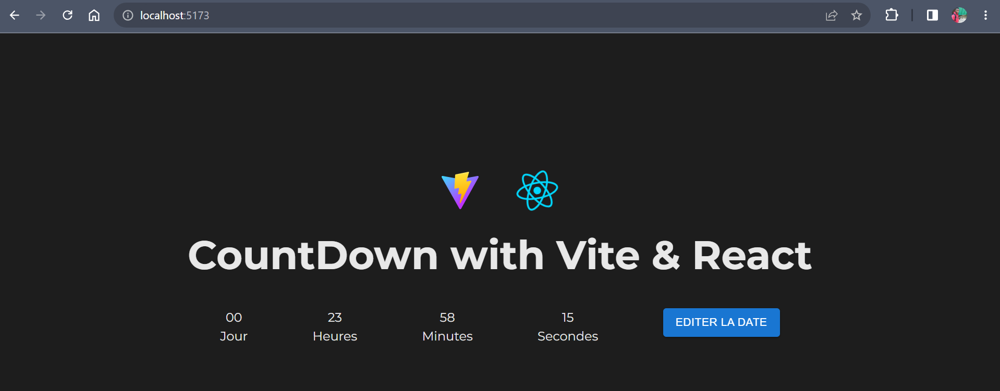

# Countdown with  + 
## Getting Started

- Clone this repo
- `npm install` to install all required dependencies
- `npm run dev` to start the local server (this project has been builded with ViteJs)
- `npm run test` or `npx jest` to run your tests

## Usage
Visit your app to the url `localhost:5173`

You can click to the button `Editer la date` to set your date and see the countdown tell you in how long your date will arrive.
